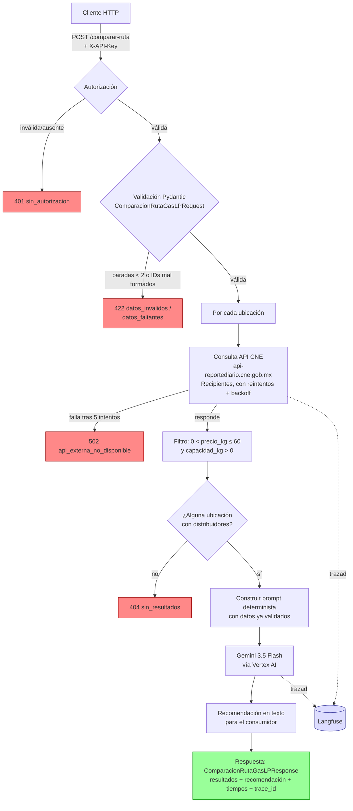

# Proyecto Final — Comparador de precios de Gas LP por recipiente

## Ficha del caso

**Usuario:** Un consumidor de Gas LP que tiene su propio cilindro/recipiente
y quiere saber a qué planta de distribución ir a cargarlo pagando el menor
precio posible.

**Entrada:** Una lista de ubicaciones (entidad/municipio/localidad del
catálogo de la CNE) que el consumidor está dispuesto a considerar.

Ejemplo:
```json
{
  "paradas": [
    {"entidad_id": "05", "municipio_id": "035", "localidad_id": "448", "etiqueta": "Torreón (Antonio Guerrero)"},
    {"entidad_id": "05", "municipio_id": "035", "localidad_id": "143", "etiqueta": "Albia"}
  ]
}
```

**Salida:** Por cada ubicación, los distribuidores disponibles con su precio
por kg y capacidad de recipiente, más una recomendación en texto de a dónde
ir y por qué.

Ejemplo (resumido):
```json
{
  "resultados": [
    {
      "parada": {"etiqueta": "Torreón (Antonio Guerrero)"},
      "distribuidores": [
        {"marca_comercial": "GRUPO CENTURION COMBUSTIBLES, S.A.P.I. DE C.V.", "precio_kg": 10.88, "capacidad_kg": 30.0}
      ],
      "precio_kg_minimo": 10.88
    }
  ],
  "recomendacion": "Te conviene cargar en...",
  "modelo_llm": "gemini-3.5-flash"
}
```

**Qué aporta el LLM:** Interpreta los precios ya validados y redacta la
recomendación en lenguaje natural — no decide qué consultar ni puede
inventar cifras que no estén en los datos.

**Qué valida el código:** Formato de los IDs de ubicación (regex), mínimo 2
ubicaciones, rango razonable de precio (`$0 < precio_kg ≤ $60`) y capacidad
(`> 0 kg`), autorización por API key, y reintentos ante fallos
intermitentes de la CNE.

**Qué pasa si falla:** Si la CNE no responde tras 5 intentos →
`502 api_externa_no_disponible`; si ninguna ubicación tiene distribuidores
válidos → `404 sin_resultados`; si los datos de entrada están mal formados
→ `422 datos_invalidos` / `datos_faltantes`; sin API key válida → `401
sin_autorizacion`.

## Diagrama de arquitectura



## Justificación del patrón

Se eligió un **flujo lineal y controlado** (el código decide qué consultar,
el LLM solo interpreta) en vez de dar al modelo la capacidad de decidir qué
llamar (tool calling / function calling). Los datos vienen de una fuente
**regulada por el gobierno mexicano** (CNE), y el valor del servicio depende
de que el precio mostrado sea exactamente el reportado oficialmente — no una
aproximación que el modelo decida buscar o interpretar por su cuenta.

El LLM entra únicamente **después** de que el código ya validó, consultó y
filtró los datos; su única función es redactar la recomendación en lenguaje
natural, dirigida a un consumidor final, a partir de información que ya no
puede alterar.

## Decisión: precio por recipiente (kg) en vez de precio por autotanque (litro)

La CNE reporta dos tarifas distintas para Gas LP en su endpoint de Planta de
Distribución: `AutoTanques` (precio por litro, para reparto a domicilio vía
camión) y `Recipientes` (precio por kilogramo, para consumidores que llevan
su propio cilindro a la planta). Se confirmó mediante investigación externa
que esta segunda modalidad —el consumidor lleva su cilindro y la planta lo
llena cobrando por kg de diferencia entre el peso vacío y lleno— es una
práctica real y común en México, y es la que corresponde al caso de un
consumidor que "carga como gasolina", por lo que el proyecto usa
`Recipientes` como fuente de precio.

## Hallazgo: inestabilidad de la API de la CNE

La API de la CNE presenta una tasa de fallo intermitente (~30-40% en
pruebas) con el error interno `"Referencia a objeto no establecida..."`. Se
implementaron reintentos con backoff exponencial (5 intentos, hasta ~22s) y
headers explícitos (`Accept-Language`) que redujeron la tasa de fallo
original (~100% sin los headers) pero no la eliminaron por completo. Se
considera un riesgo operativo documentado del proveedor, no un defecto del
servicio propio.